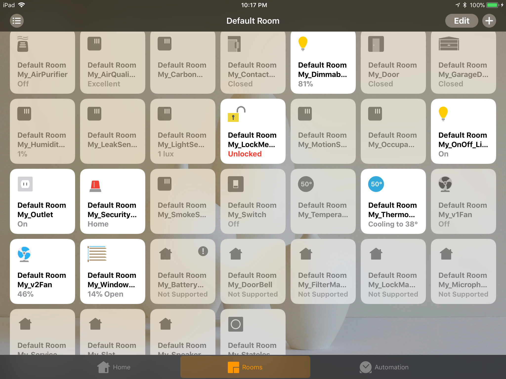
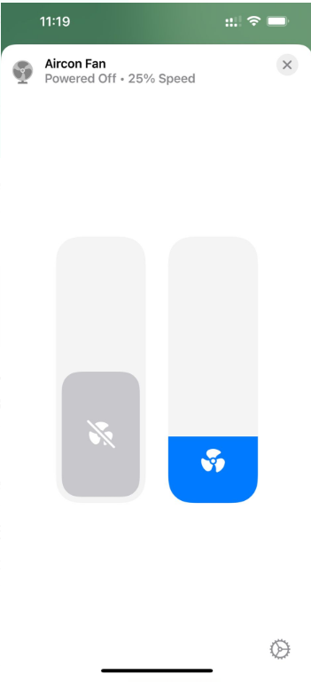
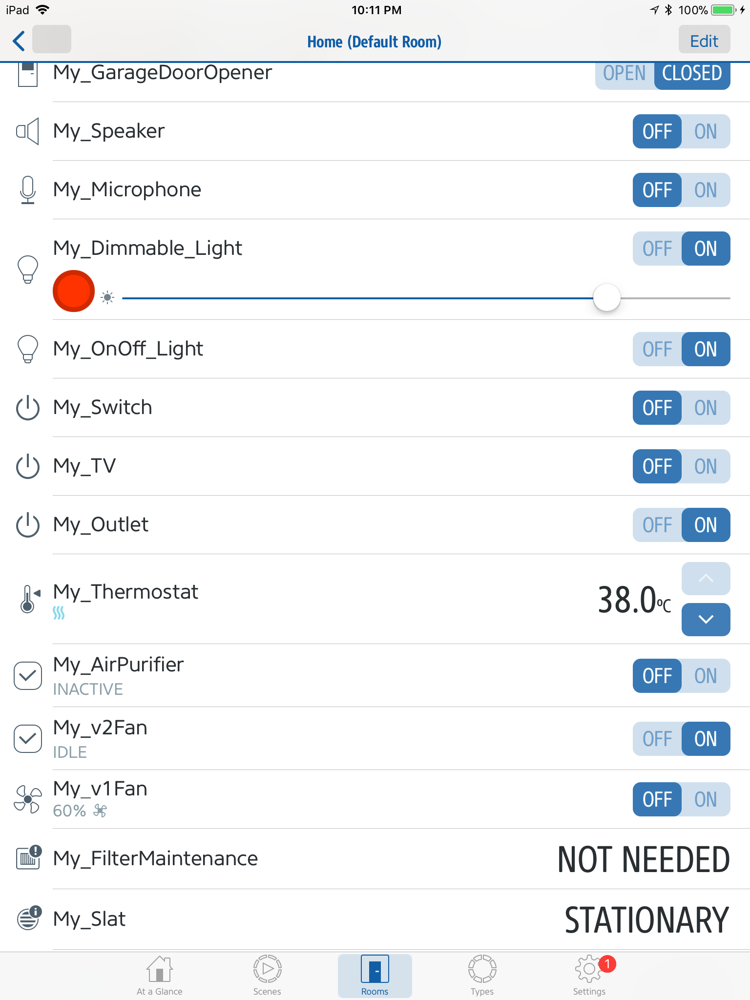

[npm]:https://www.npmjs.com/package/homebridge-cmd4
[dl]:https://flat.badgen.net/npm/dt/homebridge-cmd4?scale=1
[v]:https://flat.badgen.net/npm/v/homebridge-cmd4?icon=npm&label&scale=1
[license]:https://flat.badgen.net/npm/license/homebridge-cmd4?icon=npm&scale=1


[docs]:https://ztalbot2000.github.io/homebridge-cmd4/autoGenerated/CMD4_AccessoryDescriptions.html

### <p align="right">[![][dl]][npm] [![][license]][npm] [![][v]][npm]</p>
### Homebridge Cmd4

<base _target="_self">

[Homrbridge Cmd4](https://www.npmjs.com/package/homebridge-cmd4) makes it easy to integrate [many accessorys][docs] into [Homebridge](https://github.com/homebridge/homebridge)

> [!IMPORTANT]
> Homebridge UI Users. Do not click on any inline links. Homebridge UI does not supprt them. Bug [#90](https://github.com/ztalbot2000/homebridge-cmd4/issues/90)

<br>

&emsp;[Installation](#installation)<br>
&emsp;[Configuration](#Configuration)<br>
&emsp;[Advanced Features](#Advanced-Features)<br>
&emsp;[Basic Troubleshooting](#Basic-Troubleshooting)<br>
<br>

### <p>usage scenarios</p>
you want to see what homebridge is all about, without actually owning a single accessory!<br>
just [Install](#installation) and use the [demo config](#Configuration) and you can try out pretty much all homebridge has to offer<br>
<br>
or you want to integrate a device into homebridge without writing your own plugin!<br>
Cmd4 brings cli support for all [Supported Accessories][docs]. Use a [Custom config](#Configuration) plus a simple script in your preferd language.
<br><br><br><br>


### <p style="font-size: 23px; font-weight: 700;">Gallery</p>
<p float="left">
<a href="#Configuration">

</a>
&nbsp;
<a href="#Advanced-Features">

</a>
&nbsp;
<a href="#Advanced-Features">

</a>
</p>´
<br><br><br><br>


### <p>Installation</p>
####  &emsp; &emsp; Install [Homebridge](https://github.com/homebridge/homebridge?tab%253Dreadme-ov-file#installation)
####  &emsp; &emsp; Install Homebridge Cmd4 plugin either via the [homebridge ui](http://localhost:8581/plugins) or via npm
```bash
   sudo npm install -g --unsafe-perm homebridge-cmd4
```
<br><br><br><br>


### Configuration
#### &emsp; &emsp; To Demo use the provided [demo config](Extras/config.json)
> [!NOTE]
> save or backup your existing config `.homebridge/config.json` befor
```bash
   cp /usr/local/lib/node_modules/homebridge-cmd4/Extras/config.json $HOME/.homebridge/
```
<br>

####  &emsp; &emsp; Custom config via [homebridge ui editor](http://localhost:8581/config)
The Demo config has no polling defined. When no polling is defined for that accessory all values are retrieved and set from cache.<br>
Only for polled characteristics the statecmd is called. ok. it is simpler than it sounds lets see a basic example
```yaml
   1  {
   2      "platform": "Cmd4", 
   3      "name": "Cmd4",
   4      "debug": true,    # true here to see more clearly whats happening
   5      "accessories": [
   6      {
   7          "type": "Lightbulb",           # Type of Accessory or Device
   8          "name": "TestLight",
   9          "displayName": "TestLight",
  10          "on": "0",                     # for Lightbulbs on is a Required Characteristic see docs
  11          "brightness": 10,              # for Lightbulbs brightness is an Optional Characteristic see docs 
  12          "state_cmd": "python3 script.py",     # see below state cmd
  13          "polling": true                       # see below polling
  14      }
  15      ]
  16  },
```

> [!IMPORTANT]
> **required & optional Characteristics** are listed for each Accessory in the [docs][docs]


> [!IMPORTANT]
> **state cmd** is called with some arguments for each **polled** characteristics. the arguments are either<br>
> &emsp; `'set'` `'characteristic'` `'value'` or<br>
> &emsp; `'get'` `'characteristic'` here a return value is expected<br><br>

> [!NOTE]
> **so scenario** you open the home app - this causes cmd4 to `get` the `on` Characteristic via <br>
> &emsp;`python3 script.py 'get' 'on'` and it expects a return value here `1` or `0`<br>
> **then** you tap the lightbulb in the home app - this causes cmd4 to `set` the `on` Characteristic via<br>
> &emsp;`python3 script.py 'set' 'on' '1'`<br>
> your script has to handle the arguments accordingly see script [templates & examples](Extras/Cmd4Scripts/Examples) and [docs][docs] under Script Templates <br>

> [!IMPORTANT]
> The **`"polling": true`** enables the statecmd only for **Required Characteristics** so here only for `on` the state cmd is called see scenario above<br>
> to poll, alias enable the state cmd, for **optional** Characteristics too you have to implement polling per characteristic<br>
> ```yaml    
>   ...
>   13    "polling": [
>             {"characteristic": "on", "interval": 2},  # interval in seconds
>             {"characteristic": "brightness", "interval": 2, "timeout": 500}
>         ]
> ```
<br><br><br><br>


### Advanced Features
with [**grouped Accessories or linked Types**](https://github.com/ztalbot2000/homebridge-cmd4/issues/121#issuecomment-1010596136) you can combine multible accessories into one tile in the home app.<br>
Plus many more posebileties with [**Custom Caracteristics**](docs/Developers.md#developer-notes), [**Fakegato History**](docs/Developers.md#adding-in-fakegato-history) and [**Priority Queued Polling**](docs/Developers.md#priority-queued-polling)
<br><br><br><br>


### Basic Troubleshooting
#### &emsp; &emsp; &emsp; &emsp;  Error: Command failed
This error is indicative to many situations. The most common is that the command took to long to run.
Check that the command exists, but also that the timeout value in your config.json for that accessory is not too low.

```sh
  Error: Command failed: /homebridge/Server.sh Get 'Server' 'On'

    at ChildProcess.exithandler (child_process.js:297:12)
    at ChildProcess.emit (events.js:193:13)
    at maybeClose (internal/child_process.js:1001:16)
    at Process.ChildProcess._handle.onexit (internal/child_process.js:266:5)
  killed: true
  code: null
  signal: SIGTERM,
  cmd: "/homebridge/Server.sh Get Server On"

```

#### &emsp; &emsp; &emsp; &emsp; Debug Flag
There are two ways to enable Cmd4 Debug logs. Either set `"debug": true` in the [Config](#Configuration) or add `DEBUG` environmntal variable.
With Homebridge ui you only need to write Cmd4 in the Environmental variable section.
<br>

#### &emsp; &emsp; &emsp; &emsp; Statecmd Formatting
when ever you have `"` or `'` in side your statecmd. escape the parenthesis with a backslash ` \" ` 
eg. this fails `"state_cmd": "python -c 'print("true")'"` but this works `"state_cmd": "python -c 'print(\"true\")'"`
<br><br><br><br>


### TODO
&emsp; Become Homebridge Certified. ( The schema file for Homebridg-ui  would be very difficult )
<br><br><br><br>


### Contributing
&emsp; Star it on GitHub - if you use it and like it please at least star it :)<br>
&emsp; Follow the repo on GitHub<br>
&emsp; Open [issues or tickets](https://github.com/ztalbot2000/homebridge-cmd4/issues)<br>
&emsp; Submit fixes and or improvements with [Pull Requests](https://github.com/ztalbot2000/homebridge-cmd4/pulls)<br>
&emsp; Follow me [ztalbot2000](https://github.com/ztalbot2000)
<br><br><br><br>


### Inspiration and special thanks
&emsp; Based on the best of:<br>
&emsp; [homebridge-cmd](https://github.com/senyoltw/homebridge-cmd.git)<br>
&emsp; [homebridge-cmdswitch2](https://github.com/luisiam/homebridge-cmdswitch2.git)<br>
&emsp; [homebridge-real-fake-garage-doors](https://github.com/plasticrake/homebridge-real-fake-garage-doors.git)<br>
&emsp; [homebridge-homeseer](https://github.com/jrhubott/homebridge-homeseer.git)<br>
&emsp; Thanks to [TimofeyK](https://github.com/TimofeyK) for all his help with fakegato and for suggesting it.<br>
&emsp; Thanks to [Mitch Williams](https://github.com/mitch7391) for his endless encouragement.<br>
&emsp; Thanks especially to those who continue to work on Homebridge and those who make it better.<br>
&emsp; And most importantly my Wife.<br>
<br><br><br><br>


### [LICENSE](License)
